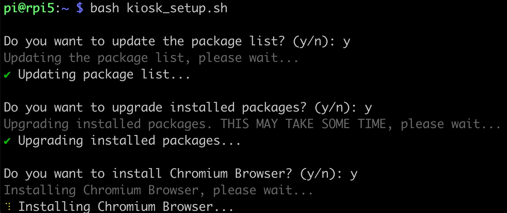

# Raspberry Pi Kiosk Display System

Welcome to the **Raspberry Pi Kiosk Display System** project! This project provides an easy-to-configure system to turn your Raspberry Pi into a kiosk, running a full-screen browser with **labwc** (a Wayland compositor) and supporting hardware like the Raspberry Pi 4 and 5.

Previously, we worked on [**Buildroot-WebKit**](https://github.com/TOLDOTECHNIK/buildroot-webkit), but due to challenges in porting to newer hardware, we've transitioned to this solution based on **Raspberry Pi OS** and **Chromium browser**. While we are no longer maintaining Buildroot-WebKit for Raspberry Pi 4 and 5, this new setup offers flexibility, **3D-accelerated graphics**, and ease of use for many kiosk display scenarios.

We encourage feedback and pull requests!

## 🚀 Features

- **Supports Raspberry Pi 4 & 5**: Tested with Raspberry Pi OS Bookworm (2024-07-04).
- **3D-Accelerated Graphics**: Utilizes hardware-accelerated graphics for improved performance in kiosk applications.
- **Wayland & labwc**: Provides a smooth experience with Wayland display server protocol and labwc compositor.
- **Chromium in Kiosk Mode**: Runs Chromium in full-screen kiosk mode, perfect for web-based digital signage. NOTE: Chromium requires at least 1GB of RAM but may still run on lower specifications.
- **Customizable Resolution**: Easily configure screen resolutions.
- **Auto-Start & Auto-Login**: Uses `greetd` to auto-start labwc at boot.
- **Plymouth Splash Screen**: Optionally configure a custom splash screen for a polished boot experience.
- **Sound**: Sound has not been tested yet in this setup.

## 📋 Requirements

- This setup is compatible with nearly all Raspberry Pi boards (tested on RPi Zero 2 W and RPi 5).
- A fresh installation of Raspberry Pi OS Bookworm (tested with **2024-10-22-raspios-bookworm-armhf-lite** on Raspberry Pi 5)
- Display connected to the first HDMI port (next to the Raspberry Pi 5 USB Type C port)

## 🛠️ Setup Instructions

1. **Prepare Your SD Card:**
   - Use [Raspberry Pi Imager](https://www.raspberrypi.com/software/) to install Raspberry Pi OS on your SD card.
   - Enable SSH, set Wi-Fi, and configure hostname as needed.

2. **Run the Setup Script:**
   - Copy the `kiosk_setup.sh` script to your running Raspberry Pi.
   - Execute the script (ensure you're not the root user):
     ```bash
     bash kiosk_setup.sh
     ```
     OR
   - simply run `bash <(curl -s https://raw.githubusercontent.com/TOLDOTECHNIK/Raspberry-Pi-Kiosk-Display-System/main/kiosk_setup.sh)`


3. **Follow the On-Screen Prompts:**
   - The script will guide you through several optional setup steps like updating the package list, installing Chromium, configuring display resolution, and more.
   - Sample terminal output:
     
     

## ⚙️ Customization Options

- **Chromium Kiosk Mode**: By default, Chromium runs in kiosk mode loading a sample page (`https://webglsamples.org/aquarium/aquarium.html`). You can customize this URL in the `~/.config/labwc/autostart` file:
  ```ini
  /usr/bin/chromium-browser --incognito --autoplay-policy=no-user-gesture-required --kiosk <your-url>
- **Resolution Configuration**: The script allows you to set a display resolution (e.g., 1920x1080) for both the labwc compositor and Raspberry Pi boot configuration.
- **Plymouth Splash Screen**: Optionally install and configure a splash screen to hide boot messages and give your kiosk a clean startup look.

## 📝 Known Issues & Future Improvements
- **Sound** has not yet been tested in this setup.
- **Tweaking**: This setup is still in development and may exhibit some unexpected behavior.

Please report any issues or suggest enhancements via GitHub issues or pull requests.

## 🙏 Contribution

We welcome feedback, suggestions, and contributions. If you encounter any bugs or have ideas for improvements, feel free to open an issue or submit a pull request.
